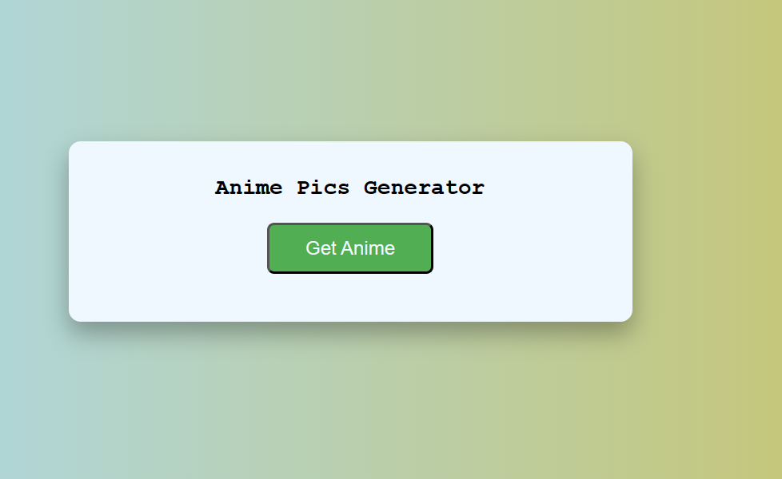
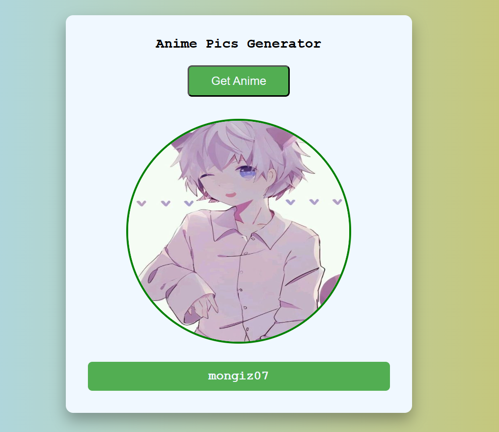

# Anime-Pics-Generator

## Decription
The Anime Pics Generator is a simple web application that allows users to generate random anime images using an API. It's built with JavaScript and utilizes an anime image API to fetch and display random anime pictures. Whether you're an anime fan or just looking for some cool anime artwork, this app has got you covered.

## Features
1. Random Anime Images
Click the "Get Anime" button to fetch and display a random anime image.
2. Endless Entertainment
Keep clicking "Get Anime" to discover a wide variety of anime artwork and characters.

